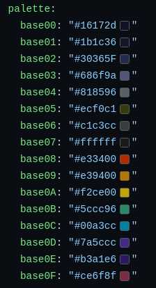
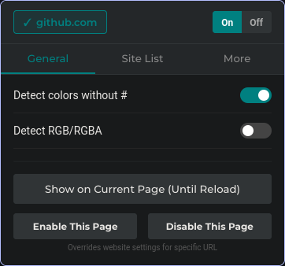

# Color Preview Extension

[](https://addons.mozilla.org/en-US/firefox/addon/code-color-preview/)


A Firefox extension that displays inline color previews next to hex and RGB color codes.




## Features

- 🎨 **Automatic Color Detection**: Detects and displays color previews for:
  - Hex colors with `#` (e.g., `#FF5733`, `#abc`, `#FF5733AA`)
  - Hex colors without `#` (optional, e.g., `FF5733`)
  - RGB/RGBA colors (optional, e.g., `rgb(255, 87, 51)`, `rgba(255, 87, 51, 0.5)`)

- 🌐 **Flexible Site Management**:
  - Whitelist approach: only runs on sites you explicitly enable
  - Quick toggle button for current website in header
  - Enable entire websites (domains) or specific pages (full URLs)
  - Disable specific pages while keeping website enabled
  - Temporary show mode (until page reload)

## Installation

### From Mozilla Addons

+ Link - https://addons.mozilla.org/en-US/firefox/addon/code-color-preview/

### From Release

1. Download the latest `.xpi` file from the [Releases](https://github.com/lzhecz/code-color-preview/releases) page
2. Open Firefox and navigate to `about:addons`
3. Click the gear icon and select "Install Add-on From File..."
4. Select the downloaded `.xpi` file

### Manual Installation (Development)

1. Clone this repository:

   ```bash
   git clone https://github.com/lzhecz/code-color-preview.git
   cd code-color-preview
   ```

2. Open Firefox and navigate to `about:debugging`
3. Click "This Firefox" in the left sidebar
4. Click "Load Temporary Add-on"
5. Navigate to the extension folder and select `manifest.json`

## Usage

### Quick Start

1. Click the extension icon in your toolbar
2. Make sure the extension is **ON** (toggle at top-right)
3. Click the website name button at top-left to enable colors on the current site
   - ✓ Green checkmark = enabled
   - ✕ Red X = not enabled (default)

### Detection Options

In the **General** tab:

- **Detect colors without #**: Enable to detect hex colors like `FF5733` without the `#` prefix
- **Detect RGB/RGBA**: Enable to detect colors in `rgb()` and `rgba()` format

### Actions

**Quick Actions**:

- **Show on Current Page (Until Reload)**: Temporarily enable colors without saving
- **Enable This Page**: Add the specific URL to enabled list (overrides website setting)
- **Disable This Page**: Disable colors on this specific page only

### Managing Lists

**Site List Tab** shows three categories:

1. **Enabled Websites**: Domains where extension runs (e.g., `github.com`)
2. **Enabled Pages**: Specific URLs (e.g., `https://example.com/page.html`)
3. **Disabled Pages**: Specific URLs where extension is blocked

Each list has a "Clear List" button for bulk removal.

### Debug Output

When debug mode is enabled, you'll see:

```
[Color Preview Debug] Settings loaded: {...}
[Color Preview Debug] === Starting color preview scan ===
[Color Preview Debug] Processed X elements
```

### Contributing

Contributions are welcome! Please:

1. Fork the repository
2. Create a feature branch
3. Make your changes
4. Test thoroughly
5. Submit a Pull Request

## Browser Compatibility

- **Firefox**: 57+ (Tested on latest versions)

## Known Limitations

- Only works on sites you explicitly enable (whitelist approach by design)
- May not detect colors embedded in minified JavaScript or complex CSS
- RGB detection requires valid ranges (0-255 for each component)
- Hex without # detection only matches 6-character codes (to avoid false positives)

## Privacy

This extension:

- ✅ Runs entirely locally in your browser
- ✅ Does not collect or transmit any data
- ✅ Only accesses pages you explicitly enable
- ✅ Stores only your preferences in browser's local storage
- ✅ No external dependencies or API calls
- ✅ Open source - audit the code yourself!

## Troubleshooting

**Colors not showing up?**

1. Make sure the extension is ON (top-right toggle)
2. Enable the current website (click the website button at top-left)
3. Enable detection options if using hex without # or RGB colors

**Too many or duplicate color boxes?**

1. This might be a bug - please report it!
2. Try disabling and re-enabling the site
3. Check if multiple overlapping code elements exist

## Credits

[lzhecz](https://github.com/lzhecz)

[https://github.com/lzhecz/code-color-preview](https://github.com/lzhecz/code-color-preview)

## Support

If you encounter any issues or have suggestions:

- Open an issue on [GitHub Issues](https://github.com/lzhecz/code-color-preview/issues)
- Include:
  - Your Firefox version
  - Steps to reproduce the problem
  - Screenshots if applicable
  - HTML section that contains problem if possible
  - Console output if debug mode is enabled

---
